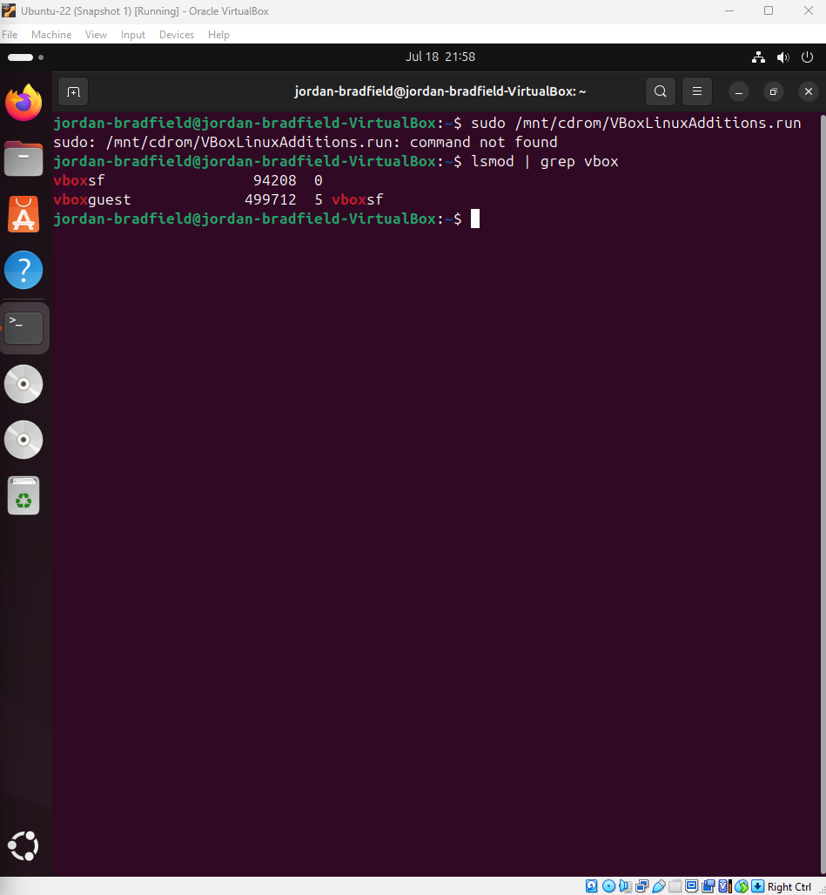

# Ubuntu VM ↔ Windows Clipboard Sharing (VirtualBox)

This is a step-by-step guide to enable **copy & paste** between an Ubuntu virtual machine and a Windows host using VirtualBox. This improves productivity for IT labs, note taking, and scripting.

---

## Table of Contents

1. [Environment](#environment)  
2. [Objective](#objective)  
3. [Step 1: Install Required Packages in Ubuntu](#step-1-install-required-packages-in-ubuntu)  
4. [Step 2: Insert Guest Additions CD](#step-2-insert-guest-additions-cd)  
5. [Step 3: Verify Guest Additions Is Active](#step-3-verify-guest-additions-is-active)  
6. [Step 4: Restart the VM (Optional)](#step-4-restart-the-vm-optional)  
7. [Step 5: Enable Bidirectional Clipboard in VirtualBox](#step-5-enable-bidirectional-clipboard-in-virtualbox)  
8. [Verification Test](#verification-test)  
9. [Summary](#summary)  

---

## Environment

- **Host OS**: Windows 11 (24H2)  
- **Guest OS**: Ubuntu 22.04 LTS  
- **Virtualization Platform**: VirtualBox 7.1+

---

## Objective

Enable **bidirectional clipboard sharing**, so you can:

- ✅ Copy text from Ubuntu → paste into Windows  
- ✅ Copy text from Windows → paste into Ubuntu

---

## Step-by-Step Instructions

### Step 1: Install Required Packages in Ubuntu

This installs kernel headers and tools needed to compile VirtualBox Guest Additions.

In the Ubuntu terminal, run:

```bash
sudo apt update
sudo apt install build-essential dkms linux-headers-$(uname -r)
```

**Screenshot of terminal after installing dependencies:**  


---

### Step 2: Insert Guest Additions CD

In the **VirtualBox VM window**:

1. Click on `Devices → Insert Guest Additions CD image...`  
2. Wait a few seconds for Ubuntu to detect and mount the disk  
3. If it doesn’t auto-mount, mount it manually:

```bash
sudo mkdir /mnt/cdrom
sudo mount /dev/cdrom /mnt/cdrom
```

📸 **Screenshot of manual mount:**  


📸 **Screenshot of menu option:**  


---

### Step 3: Verify Guest Additions Is Active

I attempted to run the Guest Additions installer manually:

```bash
sudo /mnt/cdrom/VBoxLinuxAdditions.run
```

However, it returned the following error:

```bash
sudo: /mnt/cdrom/VBoxLinuxAdditions.run: command not found
```

📸 **Screenshot of VBoxLinux Additions error:**  


---

Instead, I verified the installation using:

```bash
lsmod | grep vbox
```

Output shows `vboxguest`, `vboxsf`, or `vboxvideo` modules are loaded, confirming Guest Additions is active.

📸 **Screenshot showing verification of Guest Additions:**  


---

### Step 4: Restart the VM (Optional)

To ensure all changes take effect, reboot your Ubuntu VM:

```bash
sudo reboot
```

---

### Step 5: Enable Bidirectional Clipboard in VirtualBox

After the reboot:

1. Go to the VM window → `Devices → Shared Clipboard → Bidirectional`  
2. (Optional) Also enable `Drag and Drop → Bidirectional`

📸 **Screenshot showing VirtualBox Devices menu:**  


---

## Verification Test

Try copying the following command from your host (Windows):

```bash
echo "Clipboard sharing works!"
```

Paste it into your Ubuntu VM terminal and run it. You should see:


📸 **Screenshot showing successful copy-paste test:**  


---

## Summary

Getting bidirectional clipboard sharing working between an Ubuntu VM and a Windows host isn’t always straightforward. Along the way, I faced some challenges, especially with running the Guest Additions installer manually, which didn’t work as expected.  

However, after confirming the necessary kernel modules were loaded, the real breakthrough came when I enabled **Bidirectional Clipboard** (and optionally Drag and Drop) in the VirtualBox Devices menu (Step 5).  

This simple step finally unlocked seamless copy-paste functionality both ways, which has made working with the VM much smoother and more productive.  

If you run into issues, double check the Guest Additions installation and make sure those Devices menu options are enabled. Once everything’s set up, you’ll be able to copy commands, text, and notes effortlessly between your host and VM—saving you time and frustration.


